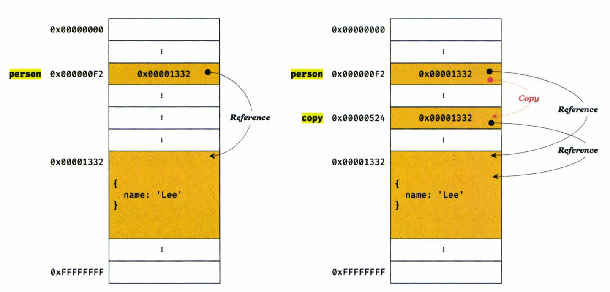

# Chapter 11 원시 값과 객체의 비교

## 주요 내용 정리

### 원시 값

자바스크립트가 제공하는 7가지의 데이터 타입은 **두가지로** 구분할 수 있다.

> 7가지 데이터 타입 ⇒ *숫자, 문자열, 불리언, null, undefined, 심벌, 객체 타입*
> 

1️⃣ `원시 타입`

- 변경 **불가능**한 값
- 원시 값을 변수에 할당하면, 변수에는 **실제 값**이 저장된다.
    - 이 변수를 다른 변수에 할당하면, 원본의 `원시 값`이 **복사되어 전달된다.**
        
        **⇒ 값에 의한 전달**
        

2️⃣ `객체 타입`

- 변경 **가능**한 값
- 객체를 변수에 할당하면, 변수에는 **참조 값**이 저장된다.
    - 이 변수를 다른 변수에 할당하면, 원본의 `참조 값`이 **복사되어 전달된다.**
        
        **⇒ 참조에 의한 전달**
        

> ❓ *원시 값은 변경 불가능하다 ?* ❓
> 

⇒ 원시 값 자체를 변경할 수 없다는 뜻.

⇒ 변수 값은 재할당을 통해 변경할 수 있다.

    ↔ 변수의 상대 개념인 상수는 재할당이 금지되어 있다.

```jsx
// const 키워드를 통해 선언한 변수는 재할당이 금지된다. 상수는 재할당이 금지된 변수.
const o = {};

// const 키워드를 사용해 선언한 변수에 할당한 원시 값(상수)은 변경할 수 없다.
// 하지만 const 키워드를 사용해 선언한 변수에 할당한 객체는 변경할 수 있다.
o.a = 1;
console.log(o); // {a: 1}
```

> ❗️ 원시 값은 변경 불가능하다! ❗️
> 

⇒ 읽기 전용 값이다. 데이터의 `신뢰성`을 보장한다.

⇒ 원시값을 재할당하면, 메모리 공간에 저장된 이전의 원시 값을 변경하는 게 아니라
새로운 메모리 공간을 확보하고 재할당한 원시 값을 저장하고, 참조하는 주소를 변경해 이를 가리키도록 한다.


### 값에 의한 전달

“변수에 변수를 할당했을 때 `무엇이` `어떻게` 전달되는가?”

```jsx
var score = 80;
var copy = score; // 변수에 변수를 할당

console.log(score); // 80
console.log(copy); // 80

score = 100;

console.log(score); // 100
console.log(copy); // ?
```

- copy = score 에서 score는 변수 값 `80` 으로 평가된다.
- 따라서 copy = 80 과 동일한 개념이다. 새로운 숫자 80이 생성되어 할당된다.
    
    📍 이렇게, 값이 복사되어서 전달되는 현상을 **값에 의한 전달** 이라고 한다.
    

```jsx
var score = 80;

var copy = score;

console.log(score, copy); // 80 80
console.log(score === copy); // true

// score, copy 각각의 변수 값은 다른 메모리 공간에 저장된 별개의 값이다.
// 따라서 하나를 변경해도 영향을 주지 않는다.
score = 100;

console.log(score, copy); // 100 80
console.log(score === copy); // false
```

- 값에 의한 전달은 , 다른 메모리 공간에 저장된 별개의 값으로 작용한다.

### 참조에 의한 전달

여러 개의 식별자가 하나의 객체를 공유할 수 있다.

→ `참조에 의한 전달` 로, 예상치 못한 부작용이 발생할 수 있다.

```jsx
var person = {
	name: 'Lee'
};

// 참조 값을 복사(얕은 복사)
var copy = person;
```



- person을 사본 copy에 할당하면, 원본 person의 `참조 값`을 복사하여 copy에 저장한다.
    
    ⇒ 결국, 메모리 주소는 다르지만 동일한 참조 값을 가지기에 동일한 객체를 가리켜버린다.
    

## 다시 짚고 가는 부분

🔎 얕은 복사

- 한 단계까지만 복사

🔎 깊은 복사

- 객체에 중첩되어 있는 객체까지 모두 복사

```jsx
const v = 1;

// 깊은 복사
const c1 = v;
console.log(c1 === v); // true

const o = { x: 1 };

// 얕은 복사
const c2 = o;
console.log(c2 === o); // true
```

## 기타 사항