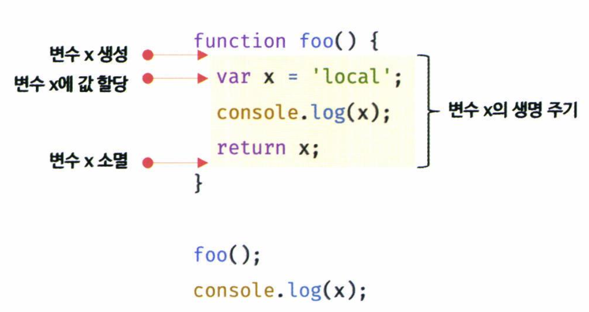
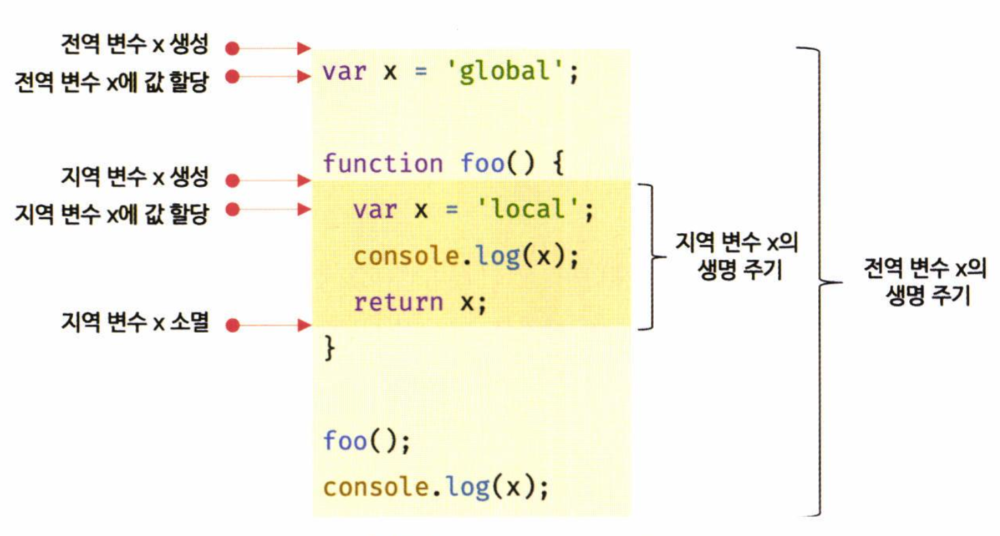

# 14. 전역 변수의 문제점

Created: 2024년 8월 5일 오후 9:45

# Chapter 14 전역 변수의 문제점

## 주요 내용 정리

<aside>
💡 전역 변수의 무분별한 사용은 위험하다. ⇒ 반드시 사용해야 할 경우 외에는 `지역 변수`를 !!

</aside>

### 변수의 생명 주기

- 변수는 생물과 같은 존재.
    
    ⇒ `생명 주기` 가 존재한다. **생성**되고 **소멸**된다.
    
    why ?
    
    - *생명 주기가 없다면,* 한 번 선언된 변수가 메모리 공간을 **영원히** 점유해버린다.

- “ 선언된 위치 “에서 생성되고 소멸한다.
    1. 전역 변수 ⇒ **애플리케이션의 생명 주기와 같다.**
    2. 지역 변수 ⇒ 함수가 호출되면 생성되고 함수 종료 시 소멸된다. **함수의 생명 주기와 같다.**
    
    > 즉, 변수의 생명 주기는
    메모리 공간이 확보된 시점에서 메모리 공간이 해제되어 가용 메모리 풀에 반환되는 시점까지이다.
    > 

```jsx
function foo() {
	var x = 'local';
	console.log(x); // local
	return x;
}

foo();
console.log(x); // ReferenceError: x is not defined
```

- x는 foo 함수 내에 선언된 지역 변수.
    - foo 함수가 호출되기 이전에는 생성되지 않는다.



- Quiz
    
    > 출력되는 값은?
    > 
    
    ```jsx
    var x = 'global';
    
    function foo() {
    	console.log(x); // ?
    	var x = 'local';
    }
    
    foo();
    console.log(x); // global
    ```
    
    - Answer
        - 지역변수 x는 `?` 시점에 이미 선언 되어있고, **undefined**로 초기화되어 있다.
        - 따라서, 전역 변수 x가 아니라 지역 변수 x를 참조해 값을 출력한다.
        - 호이스팅은 스코프를 단위로 동작한다.
            - `전역 변수`의 호이스팅은 전역 변수의 선언이 전역 스코프 상위로 끌어 올려진 것처럼 동작한다.
                - 따라서 전역 변수는 전역 전체에서 유효.
            - `지역 변수`의 호이스팅은 지역 변수의 선언이 지역 스코프 상위로 끌어 올려진 것처럼 동작한다.
                - 따라서 지역 변수는 함수 전체에서 유효.

> 전역 코드는 명시적 호출 없이 실행
> 
> - 함수 호출 같은 특별한 진입점이 없음
>     - 함수 ⇒ 함수 몸체의 마지막 문 또는 반환문 실행 시 종료
> - 전역 코드는 반환문이 없음
>     - ⇒ 마지막 문이 실행되어 더 이상 실행할 문이 없을 때 종료



- 브라우저 환경에서 `전역 객체`는 **window**
    - var 키워드로 선언한 전역 변수 x는 전역 객체 window의 프로퍼티
- window 전역 객체는 웹페이지를 닫기 전까지 유효
    
    ⇒ 브라우저 환경에서 var 키워드로 선언한 전역 변수는 웹페이지를 닫을 때까지 유효
    
    > **`var` 키워드로 선언한 전역 변수의 생명 주기는 전역 객체의 생명 주기와 같다**
    > 

### 전역 변수의 사용 억제 방법

<aside>
💡 전역 변수를 반드시 사용할 이유가 없다면 지역 변수를 사용해야 한다.

- 변수 스코프는 좁을 수록 좋다
</aside>

### 1. 즉시 실행 함수

> 모든 코드를 즉시 실행 함수로 감싸면
> 
> 
> ⇒ 모든 변수는 즉시 실행 함수의 지역 변수가 된다.
> 

```jsx
(function () {
	var foo = 10; // 즉시 실행 함수의 지역 변수
	// ...
}());

console.log(foo); // ReferenceError: foo is not defined
```

- 전역 변수를 생성하지 않기 때문에 라이브러리 등에서 자주 사용된다.

### 2. 네임스페이스 객체

> 전역에 네임스페이스 역할을 담당할 객체를 생성하고
> 
> - 전역 변수처럼 사용하고 싶은 변수를 프로퍼티로 추가한다.

```jsx
var MYAPP = {}; // 전역 네임스페이스 객체

MYAPP.name = 'Lee';

console.log(MYAPP.name); // Lee
```

- 네임스페이스 객체 안에 또 다른 네임스페이스 객체를 프로퍼티로 추가해서 계층적으로 구성할 수 있다.

```jsx
var MYAPP = {}; // 전역 네임스페이스 객체

MYAPP.person = {
	name: 'Lee',
	address: 'Seoul'
};

console.log(MYAPP.person.name); // Lee
```

⇒ 식별자 충돌을 방지하는 효과

⇒ 네임스페이스 객체 자체가 전역 변수에 할당되기 때문에 유용하지는 않다

### 3. 모듈 패턴

> 클래스처럼, 관련 있는 변수와 함수를 모아 즉시 실행함수로 감싸 `모듈`을 만든다.
> 

```jsx
var Counter = (function () {
	// private 변수
	var num = 0;
	
	// 외부로 공개할 데이터나 메서드를 프로퍼티로 추가한 객체를 반환한다.
	return {
		increase() {
			return ++num;
		},
		decrease() {
			return --num;
		}
	};
}());

// private 변수는 외부로 노출되지 않는다.
console.log(Counter.num); // undefined

console.log(Counter.increase()); // 1
console.log(Counter.increase()); // 2
console.log(Counter.decrease()); // 1
console.log(Counter.decrease()); // 0
```

- 즉시 실행함수가 객체를 반환한다.
    - 객체에는 외부에 노출하고 싶은 변수나 함수를 담아 반환한다.
        - 반환되는 객체 프로퍼티 ⇒ public member
        - 객체에 추가하지 않은 변수나 함수 ⇒ private member

### 4. ES6 모듈

> 더이상 전역 변수 사용 불가
> 
> - ES6 모듈은 파일 자체의 독자적인 모듈 스코프를 제공한다.
> 
> ⇒ 모듈 내 `var` 키워드 변수는 전역 변수가 더이상 아니고, window 객체의 프로퍼티도 아니게 된다.
> 

```jsx
<script type="modue" src="lib.mjs"></script>
<script type="modue" src="app.mjs"></script>
```

- `type="module"` 어트리뷰트를 추가하면, 로드된 자바스크립트 파일은 모듈로서 동작한다.