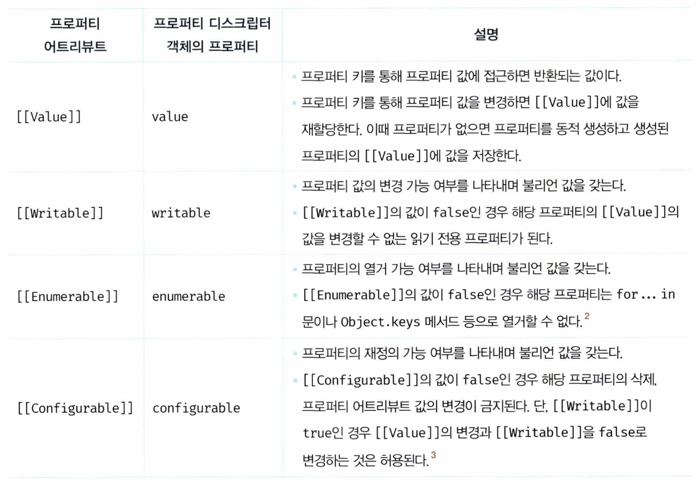
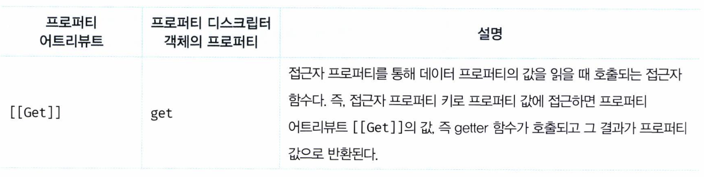
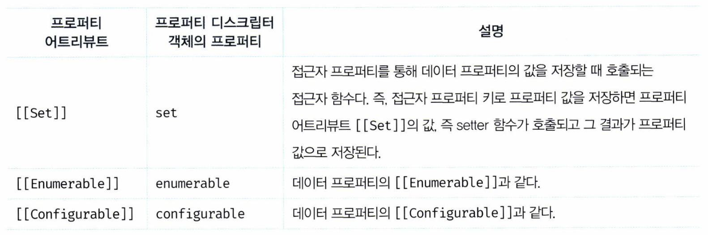
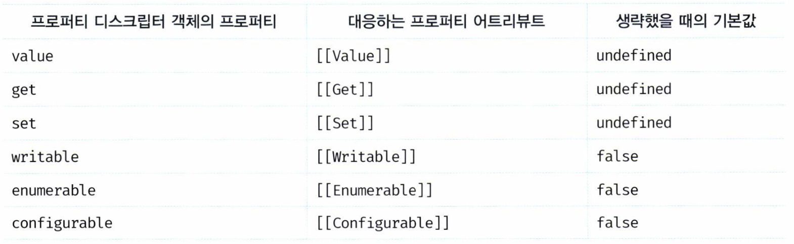
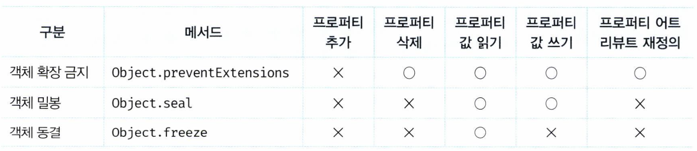

# 16. 프로퍼티 어트리뷰트

Created: 2024년 8월 11일 오후 10:19

# Chapter 16 프로퍼티 어트리뷰트

## 주요 내용 정리

### 내부 슬롯과 내부 메서드

- 내부 슬롯 : 의사 프로퍼티
- 내부 메서드 : 의사 메서드

<aside>
💡 자바스크립트 엔진에서 실제로 동작하지만,
외부로 공개된 객체의 프로퍼티는 아니다.

→ 개발자가 직접 접근 or 호출할 수 없다

</aside>

```jsx
const o = {};

// 내부 슬롯은 자바스크립트 엔진의 내부 로직이므로 직접 접근할 수 없다.
o.[[Prototype]] // -> Uncaught SyntaxError: Unexpected token '['
// 단, 일부 내부 슬롯과 내부 메서드에 한하여 간접적으로 접근할 수 있는 수단을 제공하기는 한다.
o.__proto__ // -> Object.prototype
```

- 모든 객체는 [[Prototype]] 이라는 내부 슬롯을 가진다.
- 자바스크립트 엔진의 내부 슬롯은 원칙적으로 직접 접근할 수 없다.
    - 하지만 [[Prototype]] 내부 슬롯은, `__proto__` 를 통해 간접적으로 접근할 수 있다.

### 프로퍼티 어트리뷰트와 프로퍼티 디스크립터 객체

<aside>
💡 자바스크립트 엔진은 프로퍼티를 생성할 때
프로퍼티의 `상태`를 나타내는 **프로퍼티 어트리뷰트**를 **기본값**으로 자동 정의한다.

</aside>

- 프로퍼티 상태란?
    - 프로퍼티의 값 (value)
    - 값의 갱신 가능 여부 (writable)
    - 열거 가능 여부 (enumerable)
    - 재정의 가능 여부 (configurable)
- 프로퍼티 어트리뷰트
    - `[[Value]]`
    - `[[Writable]]`
    - `[[Enumerable]]`
    - `[[Configurable]]`
    
    ⇒ 어트리뷰트에 직접 접근할 수 없다.
    
    - 하지만, **`Object.getOwnPropertyDescriptor`** 메서드로 간접적 확인은 가능하다.
    
    ```jsx
    const person = {
      name: 'Lee'
    };
    
    // 프로퍼티 어트리뷰트 정보를 제공하는 프로퍼티 디스크립터 객체를 반환한다.
    console.log(Object.getOwnPropertyDescriptor(person, 'name'));
    // {value: "Lee", writable: true, enumerable: true, configurable: true}
    ```
    
    > **`Object.getOwnPropertyDescriptor(객체의 참조, 프로퍼티 키)`** 메서드
    > 
    > - 프로퍼티 디스크립터 객체 반환
    >     - 만약 존재하지 않는 프로퍼티 or 상속받은 프로퍼티에 대해서
    >         - 프로퍼티 디스크립터를 요구하면 undefined가 반환된다.
    
    ```jsx
    const person = {
      name: 'Lee'
    };
    
    // 프로퍼티 동적 생성
    person.age = 20;
    
    // 모든 프로퍼티의 프로퍼티 어트리뷰트 정보를 제공하는 프로퍼티 디스크립터 객체들을 반환한다.
    console.log(Object.getOwnPropertyDescriptors(person));
    /*
    {
      name: {value: "Lee", writable: true, enumerable: true, configurable: true},
      age: {value: 20, writable: true, enumerable: true, configurable: true}
    }
    */
    ```
    
    > **`Object.getOwnPropertyDescriptors`** 메서드
    > 
    > - ES8 도입
    > - 모든 프로퍼티의 프로퍼티 디스크립터 객체들을 반환

### 데이터 프로퍼티와 접근자 프로퍼티

프로퍼티는 두 가지로 구분.

1. 데이터 프로퍼티
    - 키와 값으로 구성된 일반적 프로퍼티
2. 접근자 프로퍼티
    - 자체적으로는 값을 갖지 않고, 다른 데이터 프로퍼티의 값을
    읽거나 저장할 때 호출되는 접근자 함수로 구성된 프로퍼티

1. 데이터 프로퍼티
    
    
    
    ```jsx
    const person = {
      name: 'Lee'
    };
    
    // 프로퍼티 어트리뷰트 정보를 제공하는 프로퍼티 디스크립터 객체를 취득한다.
    console.log(Object.getOwnPropertyDescriptor(person, 'name'));
    // {value: "Lee", writable: true, enumerable: true, configurable: true}
    ```
    
    - 예제에서 알 수 있듯이, 프로퍼티가 생성될 때
        - [[Value]]의 값은 프로퍼티 값으로 초기화
        - 나머지는 true로 초기화
    - 프로퍼티를 동적 추가해도 동일하다.
        
        ```jsx
        const person = {
          name: 'Lee'
        };
        
        // 프로퍼티 동적 생성
        person.age = 20;
        
        console.log(Object.getOwnPropertyDescriptors(person));
        /*
        {
          name: {value: "Lee", writable: true, enumerable: true, configurable: true},
          age: {value: 20, writable: true, enumerable: true, configurable: true}
        }
        */
        ```
        
2. 접근자 프로퍼티
    
    
    
    
    
    - 접근자 함수는 getter/setter 함수라고도 부른다.
    
    ```jsx
    const person = {
      // 데이터 프로퍼티
      firstName: 'Ungmo',
      lastName: 'Lee',
    
      // fullName은 접근자 함수로 구성된 접근자 프로퍼티다.
      // getter 함수
      get fullName() {
        return `${this.firstName} ${this.lastName}`;
      },
      // setter 함수
      set fullName(name) {
        // 배열 디스트럭처링 할당: "31.1 배열 디스트럭처링 할당" 참고
        [this.firstName, this.lastName] = name.split(' ');
      }
    };
    
    // 데이터 프로퍼티를 통한 프로퍼티 값의 참조.
    console.log(person.firstName + ' ' + person.lastName); // Ungmo Lee
    
    // 접근자 프로퍼티를 통한 프로퍼티 값의 저장
    // 접근자 프로퍼티 fullName에 값을 저장하면 setter 함수가 호출된다.
    person.fullName = 'Heegun Lee';
    console.log(person); // {firstName: "Heegun", lastName: "Lee"}
    
    // 접근자 프로퍼티를 통한 프로퍼티 값의 참조
    // 접근자 프로퍼티 fullName에 접근하면 getter 함수가 호출된다.
    console.log(person.fullName); // Heegun Lee
    
    // firstName은 데이터 프로퍼티다.
    // 데이터 프로퍼티는 [[Value]], [[Writable]], [[Enumerable]], [[Configurable]] 프로퍼티 어트리뷰트를 갖는다.
    let descriptor = Object.getOwnPropertyDescriptor(person, 'firstName');
    console.log(descriptor);
    // {value: "Heegun", writable: true, enumerable: true, configurable: true}
    
    // fullName은 접근자 프로퍼티다.
    // 접근자 프로퍼티는 [[Get]], [[Set]], [[Enumerable]], [[Configurable]] 프로퍼티 어트리뷰트를 갖는다.
    descriptor = Object.getOwnPropertyDescriptor(person, 'fullName');
    console.log(descriptor);
    // {get: ƒ, set: ƒ, enumerable: true, configurable: true}
    ```
    
    - firstName, lastName 프로퍼티 ⇒ 데이터 프로퍼티
    - getter, setter 함수의 fullName ⇒ 접근자 프로퍼티
        - 접근자 프로퍼티는 자체적으로 값을 가지지 않고
        - 데이터 프로퍼티의 값을 읽거나 저장할 때 관여

### 프로퍼티 정의

<aside>
💡 프로퍼티 정의란?

- 새로운 프로퍼티를 추가하면서 프로퍼티 어트리뷰트를 명시적으로 정의하거나,
- 기존 프로퍼티의 프로퍼티 어트리뷰트를 재정의하는 것
</aside>

`Object.defineProperty` 메서드를 사용해서 프로퍼티 어트리뷰트 정의

`Object.defineProperties` 메서드를 사용해서 여러 개의 프로퍼티 한 번에 정의

```jsx
const person = {};

// 데이터 프로퍼티 정의
Object.defineProperty(person, 'firstName', {
  value: 'Ungmo',
  writable: true,
  enumerable: true,
  configurable: true
});

Object.defineProperty(person, 'lastName', {
  value: 'Lee'
});

let descriptor = Object.getOwnPropertyDescriptor(person, 'firstName');
console.log('firstName', descriptor);
// firstName {value: "Ungmo", writable: true, enumerable: true, configurable: true}

// 디스크립터 객체의 프로퍼티를 누락시키면 undefined, false가 기본값이다.
descriptor = Object.getOwnPropertyDescriptor(person, 'lastName');
console.log('lastName', descriptor);
// lastName {value: "Lee", writable: false, enumerable: false, configurable: false}

// [[Enumerable]]의 값이 false인 경우
// 해당 프로퍼티는 for...in 문이나 Object.keys 등으로 열거할 수 없다.
// lastName 프로퍼티는 [[Enumerable]]의 값이 false이므로 열거되지 않는다.
console.log(Object.keys(person)); // ["firstName"]

// [[Writable]]의 값이 false인 경우 해당 프로퍼티의 [[Value]]의 값을 변경할 수 없다.
// lastName 프로퍼티는 [[Writable]]의 값이 false이므로 값을 변경할 수 없다.
// 이때 값을 변경하면 에러는 발생하지 않고 무시된다.
person.lastName = 'Kim';

// [[Configurable]]의 값이 false인 경우 해당 프로퍼티를 삭제할 수 없다.
// lastName 프로퍼티는 [[Configurable]]의 값이 false이므로 삭제할 수 없다.
// 이때 프로퍼티를 삭제하면 에러는 발생하지 않고 무시된다.
delete person.lastName;

// [[Configurable]]의 값이 false인 경우 해당 프로퍼티를 재정의할 수 없다.
// Object.defineProperty(person, 'lastName', { enumerable: true });
// Uncaught TypeError: Cannot redefine property: lastName

descriptor = Object.getOwnPropertyDescriptor(person, 'lastName');
console.log('lastName', descriptor);
// lastName {value: "Lee", writable: false, enumerable: false, configurable: false}

// 접근자 프로퍼티 정의
Object.defineProperty(person, 'fullName', {
  // getter 함수
  get() {
    return `${this.firstName} ${this.lastName}`;
  },
  // setter 함수
  set(name) {
    [this.firstName, this.lastName] = name.split(' ');
  },
  enumerable: true,
  configurable: true
});

descriptor = Object.getOwnPropertyDescriptor(person, 'fullName');
console.log('fullName', descriptor);
// fullName {get: ƒ, set: ƒ, enumerable: true, configurable: true}

person.fullName = 'Heegun Lee';
console.log(person); // {firstName: "Heegun", lastName: "Lee"}
```

- Object.defineProperty 메서드로 프로퍼티를 정의할 때 일부 생략할 수 있다.
    - 생략된 어트리뷰트는 기본값이 적용된다.
    
    
    

### 객체 변경 방지



- 객체 확장 금지
    
    > 프로퍼티 추가 금지
    > 
    - 확장 가능한 객체인지 여부 ? ⇒ `Object.isExtensible` 메서드로 확인
- 객체 밀봉
    
    > 프로퍼티 추가 및 삭제와 프로퍼티 어트리뷰트 재정의 금지
    > 
    > 
    > 밀봉된 객체는 읽기와 쓰기만 가능
    > 
    - 밀봉된 객체인지 여부? ⇒ `Object.isSealed` 메서드로 확인
- 객체 동결
    
    > 프로퍼티 추가 및 삭제와 프로퍼티 어트리뷰트 재정의 금지
    > 
    > 
    > 프로퍼티 값 갱신 금지. 동결된 객체는 읽기만 가능
    > 
    - 동결된 객체인지 여부? ⇒ `Object.isFrozen` 메서드로 확인
- 불변 객체
    
    > 직속 프로퍼티만 변경하는 것이 아니라, 중첩 객체까지 영향을 주는 메서드
    > 
    
    불변 객체를 구현하려면 객체를 값으로 갖는 모든 프로퍼티에 대해 재귀적으로 `Object.freeze` 메서드를 호출